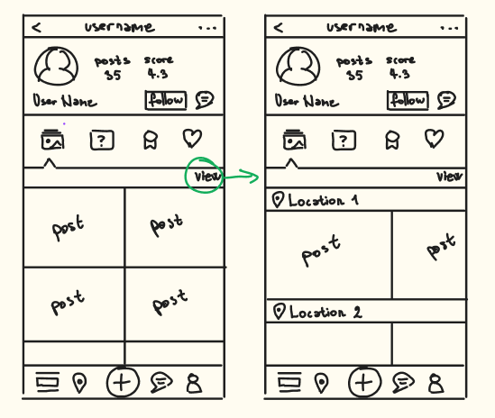

# Info for testing

## Testing user profiles

`anna` : `Ana123!!!`

`petar` : `Petar123!!!`

`lazar` : `Lazar123!!!`

## Download link and credentials

http://softeng.pmf.kg.ac.rs:10009/

`branko` : `kockica`

# BrzoDoLokacije - geography based social media; the front-end side

**A social media app for tourists and travel enthusiasts created with Java Springboot, Kotlin and Ktor.**

## Table of Contents

* [Introduction](#introduction)
* [Screenshots](#screenshots)
* [Technologies](#technologies)
* [Setup](#setup)
* [Features](#features)
* [Status](#status)

## Introduction

This is an open source project created to solve the problem that all travelers face when they want to visit an exotic location - what is there to be visited, and how it really looks without picture editing. If you've ever planned your next traveling adventure for the summer, you've certainly faced it too. The Internet is a wide place, and searching for reliable information on certain locations can be a long and exhausting process of digging through blogs, vlogs, maps and reddit groups. We strive to solve this problem by collecting all of that content in one place.

Our vision is to create a social media app that is completely oriented towards making accessing famous locations easier and chatting real time with people in any place on the globe. Every location will have its feed that users can browse and contribute to, alongside with the public chat where users can share their experiences or ask on the spot for valuable info that people currently physically present on that location can provide. 

This app is both tourist and enthusiast friendly, because _visiting_ interesting places has never been easier. Our goal is to create a platform that unites useful and fun, and that can spark our generation's interest in exploration and building friendships all across the globe.

## Screenshots

_Currently no screenshots can be provided. Check the [current project state](#status) for information._

## Technologies

These are the versions of technologies used:
* [Kotlin](https://kotlinlang.org/) 1.7.20 (stable version for Android Studio)
* [Android Jetpack Compose](https://developer.android.com/jetpack) 1.2
* [Ktor](https://ktor.io/) 2.1.3

To install the technologies you can download [Android Studio](https://developer.android.com/studio?gclid=Cj0KCQjwnvOaBhDTARIsAJf8eVPdm1eDWEc36cUFeWmGSbDSWe9HaHSQXoNa2JNS7655Nm8sHm7mqskaAnPhEALw_wcB&gclsrc=aw.ds) or download Kotlin language support extensions in Visual Studio Code. Ktor and Jetpack are used through dependencies and do not require installation. If you have problem with said libraries, sync the project dependencies again. 

_Noting that this particular repository contains only the **client side** of the application, that's created using Kotlin, Jetpack Compose and Ktor. To run this project in its full functionality, you need to clone both **front-end** and **back-end** repository on your local machine._

## Setup

To run this project, clone it into your local front-end folder. You can easily run it by clicking the Run button in Android Studio. Be sure to enable virtualization in BIOS settings and setup your Android Emulator before running.

If running it in Emulator doesn't do it for you, you can also go to Build options in Android Studio navigation bar and click _Generate Signed Bundle / APK_ option. After [creating the APK](https://stackoverflow.com/questions/16622843/how-do-i-export-a-project-in-the-android-studio) you can run the application on your Android device as well.

## Features

This is the list of planned features that are being implemented. 
* [ ] Interactive map
* [ ] Location feed
* [ ] Location public chat
* [ ] Location tags
* [ ] User profile with double view for posts
* [ ] User tags
* [ ] Notification bar with double view
* [ ] Posting functionality
* [ ] Basic search
* [ ] Scope search
* [ ] Reward system for contributers

## Status

This project is still in developing state. 

Current phase of development: `Phase 2: Project Structure`

Current feature being developed: `User profile`

